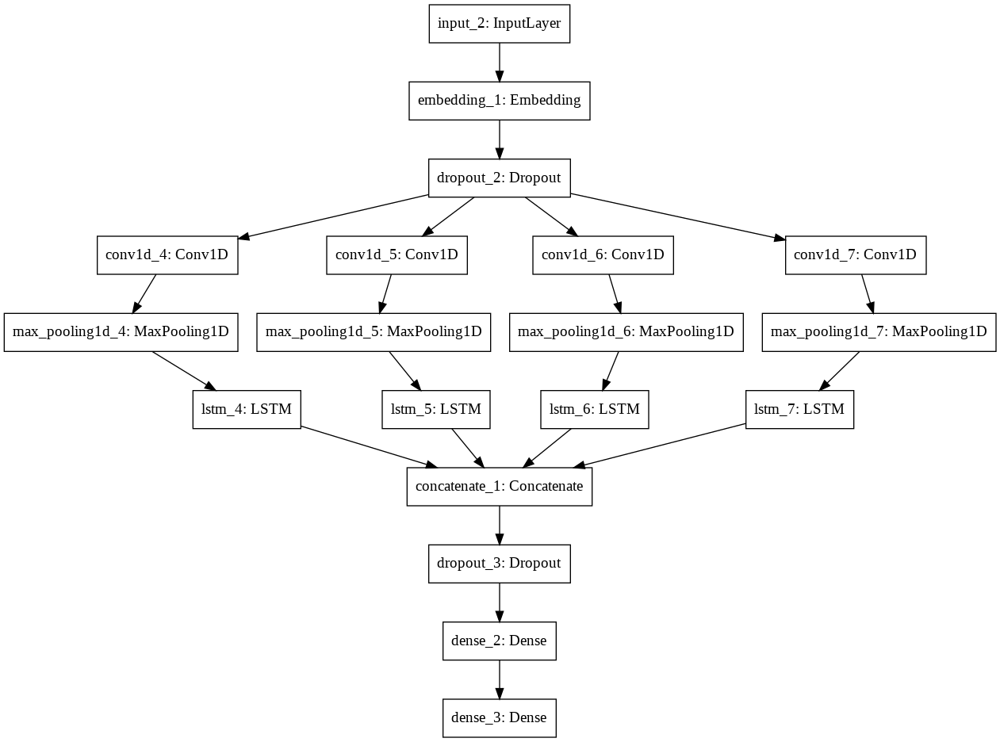

Sentiment Filter
---

Достаточно удобная нейросеть, основанная на архитектуре CNN + LSTM


Сделано на базе фреймворка **[Keras](https://keras.io)** с бэкендом **[Tensorflow](https://tensorflow.org)**

Что такое Sentiment Analysis? [Вики](https://ru.wikipedia.org/wiki/%D0%90%D0%BD%D0%B0%D0%BB%D0%B8%D0%B7_%D1%82%D0%BE%D0%BD%D0%B0%D0%BB%D1%8C%D0%BD%D0%BE%D1%81%D1%82%D0%B8_%D1%82%D0%B5%D0%BA%D1%81%D1%82%D0%B0)<br>
В моем случае тональность текста будет ограничена лишь тремя возможными положениями:
- Негативный текст
- Нейтральный текст
- Позитивный текст

Чем выше оценка текста по шкале `score ∈ [0, 1] и score ∈ ℝ`, тем негативнее текст <br>
Примеры:
- `"Лучше помолчать, чем  говорить без смысла."` - `0.308`
- `"Бесконечность - не предел!"` - `0.414`
- `"Что может быть неприятнее, чем этот ужасный комментарий, написанный не пойми каким уродом?"` - `0.994`

## Работа с библиотекой. 

### 1. Установка.
Перед началом установки, в `setup.py` убедитесь, что вы ставите именно ту версию Tensorflow (CPU или GPU), которая вам нужна
```python
USE_GPU = False  # True ->  если вам нужна GPU версия Tensorflow
```

А затем выполните установку
```bash
root@ar4ikov: /home/user/SentimentFilter# python setup.py install
```

### 2. Импортирование.
```python
import sentiment_filter as s

sentiment = s.SentimentFilter()
```

### 3. Вызов основного функционала.
```python
import sentiment_filter as s

sentiment = s.SentimentFilter()

text = """Привет, фильтрация текста от негатива - удобная штука!"""

sentiment.get_analysis(text)
# Response: {'result': <Sentiment.POSITIVE: 'positive'>, 'score': 0.005}
```

### 3.1. Проверка результата через Enum.
```python
import sentiment_filter as s

sentiment = s.SentimentFilter()

text = """Не согласен - критикуй. Критикуешь - предлагай."""
response = sentiment.get_analysis(text)
# Response: {'result': <Sentiment.POSITIVE: 'positive'>, 'score': 0.274}

if sentiment.Sentiment(response["result"]) == sentiment.Sentiment.POSITIVE:
    """Make some here"""

elif sentiment.Sentiment(response["result"]) == sentiment.Sentiment.NEGATIVE:
    """Make some here"""

else:  # sentiment.Sentiment.NEUTRAL
    """Make some here too"""
```

### 3.2. Булевы методы.
```python
import sentiment_filter as s

sentiment = s.SentimentFilter()

text = """Не согласен - критикуй. Критикуешь - предлагай."""
sentiment.is_negative(text)  # Стандартное значение негативности: score >= 0.67
# Response: False

sentiment.is_negative(text)  # Стандартное значение нейтральности: 0.45 <= score <= 0.67
# Response: False

sentiment.is_positive(text)  # Стандартное значение позитивности: score <= 0.45
# Response: True
```

### 3.2.1. Изменение `score` характеристики текста
```python
import sentiment_filter as s

sentiment = s.SentimentFilter()

text = """Не согласен - критикуй. Критикуешь - предлагай."""
sentiment.is_negative(text, score=0.26)
# Response: True

sentiment.get_analysis(text, scores=[0.1, 0.26])
# Response: {'result': <Sentiment.NEGATIVE: 'negative'>, 'score': 0.274}
```

### 4. Сервер на flask для работы веб-сервисов.
**- ПРРРР, для запуска стоит установить `flask`**<br>
```bash
root@ar4ikov:~# pip install flask
```

Далее, в самом начале файла `request_server.py` вы найдете 3 константы
```python
# ... some code ...

DEBUG = False
HOST = "localhost"
PORT = 80

# ... some code ...
```

Измените их под себя (DEBUG лично я бы советовал не трогать). 

Дальше - запуск!
```bash
root@ar4ikov: /home/user/SentimentFilter# python request_server.py
```

Стандартный запрос на
```http request
POST http://localhost:80/get_analysis?text=Привет
```

Даст ответ
```json
{
  "status":true,
  "response":
    {
      "requested_text": "Привет",
      "score": 0.301,
      "type": "positive"
    }
}
```

### 5. Сохранение результатов работы нейросети из социальных сетей
```bash
root@ar4ikov: /home/user/SentimentFilter/transport/vk# python vk.py
```
```bash
root@ar4ikov: /home/user/SentimentFilter/transport/SOME_FILE# python SOME_FILE.py
```

В самом файле нужные константы подписаны комментариями, не перепутаете.

Больше примеров работы (и с другими классами) вы найдете в **`examples`**!
